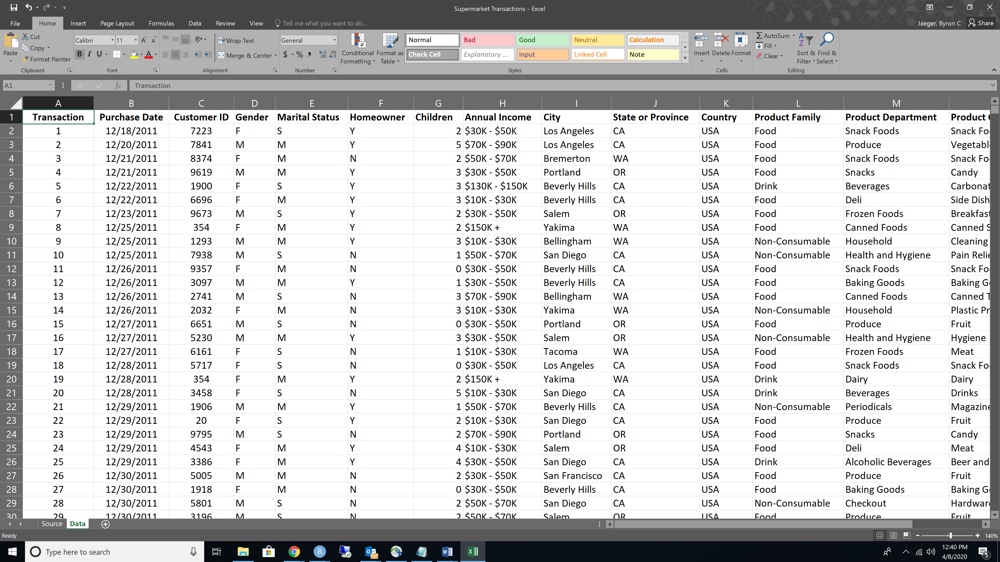

class: inverse, center, middle

```{r, include = FALSE}

library(readxl)   # for reading in Excel data
library(tibble)   # for data printing
library(dplyr)    # for data manipulation
library(ggplot2)  # for visualization
library(forcats)  # for factor handling
library(janitor)  # for cleaning

knitr::opts_chunk$set(
  echo = TRUE,
  warning = FALSE,
  message = FALSE,
  fig.width = 12,
  fig.height = 5.5,
  dpi = 72 * 5
)

supermarket <- read_excel(
  # the file location
  "data/Supermarket Transactions.xlsx",
  # the sheet name to pull data from
  # you can also use numeric order of sheets
  sheet = "Data",
  # recall that names are not supposed to have
  # spaces or special characters. The tibble package
  # can repair names like this in a systematic way.
  # Tibble will tell you what it changes.
  .name_repair = 'universal'
) %>% 
  janitor::clean_names(case = 'snake')


```

# Tidying your data

---
class: center, middle

## Going from here

```{r, echo = FALSE}

```


---

## To here

```{r}

glimpse(supermarket, width = 60)

```

---

## Import

- `read_excel()` can read specific sheets into R as `tibbles`

```{r}

supermarket <- read_excel(
  path  = "data/Supermarket Transactions.xlsx",
  sheet = "Data"
)

supermarket[1:2, 1:3]

```

Look at the first 3 names of the spreadsheet's data. What do you see?

---
background-image: url(img/janitor_clean_names.png)
background-size: 75% 
background-position: 50% 75%

## Variable names

The variable names have spaces and are written in Title Case. There's nothing inherently wrong with that, but it's less than ideal for workflow and tedious to manually rename everything. `janitor`, an R package for cleaning data, is here to help.

---

## Variable names

Pick your favorite naming convention:

```{r}

clean_names(supermarket, case = 'snake')[1:2, 1:3]

```

---

## Variable names

Pick your favorite naming convention:

```{r}
clean_names(supermarket, case = 'lower_camel')[1:2, 1:3]
```

---

## Variable names

Pick your favorite naming convention:

```{r}
clean_names(supermarket, case = 'screaming_snake')[1:2, 1:3]
```

---

```{r, echo = FALSE}
supermarket <- clean_names(supermarket, case = 'snake')
```


## Review: data summarization

Find the total `revenue` from supermarkets for each city:

```{r}

city_rev <- supermarket %>%
  group_by(city) %>%
  summarise(revenue = sum(revenue, na.rm = TRUE)) 

city_rev

```

---

## Bar charts

Without proper hygiene, bar charts devolve into the bad charts

```{r}

ggplot(city_rev, aes(x = city, y = revenue)) +
  geom_bar(stat = "identity")

```

---

## Order matters

```{r}

ggplot(city_rev) +
  aes(x = reorder(city, revenue), y = revenue) + #<<
  geom_bar(stat = "identity")

```

---

## Orientation matters

```{r}

ggplot(city_rev) +
  aes(x = reorder(city, revenue), y = revenue) +
  geom_bar(stat = "identity") + 
  coord_flip() #<<

```

---
class: center, middle

## Question

Who generates more revenue for super markets? 

--

Shoppers who are men or shoppers who are women?

---

## Data summarization

```{r}

city_rev_gender <- supermarket %>%
  group_by(city, gender) %>%
  summarise(revenue = sum(revenue, na.rm = TRUE)) %>% 
  ungroup() %>% #<<
  mutate(
    gender = recode(gender, 'F' = 'Female', 'M' = 'Male'),
    # re-order city in the data rather than the plot
    # why would this fail if data were grouped?
    city = fct_reorder(city, .x = revenue) #<<
  )

city_rev_gender[1:3,]

```

---

## Comparisons

Aesthetic option `fill` applies to the inside of bars, color applies to their border

```{r}
ggplot(city_rev_gender, aes(city, revenue, fill = gender)) + #<<
  geom_bar(stat = "identity", color = 'purple') +
  coord_flip()
```

---

## Comparisons

`position` governs how the bars are placed

```{r}
ggplot(city_rev_gender, aes(city, revenue, fill = gender)) +
  geom_bar(stat = "identity", position = "dodge") + #<<
  coord_flip()
```

---

## Comparisons

`facet_wrap()` and `facet_grid()` give one plot per group 

```{r}
ggplot(city_rev_gender, aes(city, revenue, fill = gender)) +
  geom_bar(stat = "identity", position = "dodge") +
  coord_flip() +
  facet_wrap( ~ gender) #<<
```


---

## Maximal info, minimal ink 

> Graphical excellence is that which gives to the viewer the greatest number of ideas in the shortest time with the least ink in the smallest space.
>
> `r tufte::quote_footer('--- Edward R. Tufte')`

- How can we make it easy to pick out the patterns across cities? 

- Can we use less ink?

---

## Points

```{r}

ggplot(city_rev_gender, aes(revenue, city)) +
  geom_point(aes(color = gender))

```

---

## Size

```{r}

ggplot(city_rev_gender, aes(revenue, city)) +
  geom_point(aes(color = gender), size = 3) + 
  theme(text = element_text(size = 16)) #<<


```

---

## Aesthetic inheritance

- ggplot adds layers, one by one, to a graph.

- general aesthetics for the whole graph can be set using `aes()`

    + in the `ggplot()` function
    
    + in a stand-alone `aes()` function.

- the aesthetics of the current `geom` can be set using `aes()` _inside_ the geom function.

---

The aesthetics in this line are inherited by `geom_line`

```{r, eval = FALSE}

ggplot(city_rev_gender) +
  aes(x = revenue, y = city) + #<< 
  geom_point(aes(color = gender), size = 3) +
  theme(text = element_text(size = 16)) +
  geom_line() # inherits x = revenue, y = city

```

The aesthetics in this line are __not__ inherited by `geom_line`

```{r, eval = FALSE}

ggplot(city_rev_gender) +
  aes(x = revenue, y = city) + 
  geom_point(aes(color = gender), size = 3) + #<< 
  theme(text = element_text(size = 16)) +
  geom_line() # inherits x = revenue, y = city

```

---

## Lines

the main aesthetic for lines is group. Bad groupings ruin good plots.

```{r}

ggplot(city_rev_gender) +
  aes(x = revenue, y = city) + 
  geom_point(aes(color = gender), size = 3) +
  theme(text = element_text(size = 16)) +
  geom_line(aes(group = gender)) # disaster!

```

---

## Lines

Good groupings help draw the eye to the relevant comparisons

```{r}

ggplot(city_rev_gender) +
  aes(x = revenue, y = city) + 
  geom_point(aes(color = gender), size = 3) + 
  theme(text = element_text(size = 16)) +
  geom_line(aes(group = city)) 

```

---

## Order matters

If you want points to appear on top of the lines, put the line layer down _before_ the point layer.

```{r}

ggplot(city_rev_gender) +
  aes(x = revenue, y = city) + 
  geom_line(aes(group = city)) + #<<
  geom_point(aes(color = gender), size = 3) + 
  theme(text = element_text(size = 16)) 

```

---

## Use text intelligently

Annotation can help readers understand the most relevant parts of your data. 
- `ggplot` uses `geom_text()` to add text layers

- the main aesthetic for `geom_text()` is `label`

- `ggforce`, an extension of `ggplot`, has a lot of handly annotation helpers.

Remember, minimal ink...

---

Oh dear...

```{r}

ggplot(city_rev_gender) +
  aes(x = revenue, y = city, label = revenue) +  #<<
  geom_line(aes(group = city)) +
  geom_point(aes(color = gender), size = 3) + 
  geom_text(aes(color = gender)) + #<<
  theme(text = element_text(size = 16)) 

```

---

## Your turn

- It will take some data wrangling to get this figure just how we want it. 

- Let's finish the figure in `exercises.Rmd`

